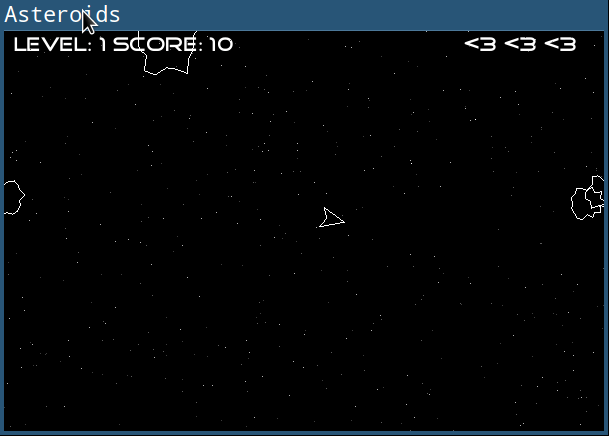

# Uridium

## Description

Some SDL2 bindings for Ruby

## FEATURES:

Providers SDL Display, GDI and some drawing primitives to ruby, as well as  an eventloop with separate simulation and rendering objects and a mixer to play sounds. Only keyboard events are supported at the moment.

## SYNOPSIS:

Running asteroids.rb from lib/examples/ will produce a classic shoot-em-up game and highlight almost all features of this lib.

## REQUIREMENTS:

### Needed libraries

- glu
- libglu1-mesa-dev
- sdl2
- sdl2_mixer
- ftgl

### Debian

    $ apt-get install libftgl-dev libsdl2-mixer-dev libsdl2-dev

### Archlinux

     $ pacman -S sdl2 sdl2_mixer ftgl freetype2

### OSX

     $ brew install sdl2_mixer sdl2 ftgl

## INSTALL:

Bundle:

     gem 'uridium', git: 'git://github.com/larte/uridium.git'

then:

     bundle install

## Run example game

     $ irb
     2.4.3 :001> require 'uridium'
     => true
     2.4.3 :001> require 'examples/asteroids/game'
     => true
     2.4.3 :001> Asteroids::Game.new.run

# LICENSE:

(The MIT License)

Copyright (c) 2009 FIX

Permission is hereby granted, free of charge, to any person obtaining
a copy of this software and associated documentation files (the
'Software'), to deal in the Software without restriction, including
without limitation the rights to use, copy, modify, merge, publish,
distribute, sublicense, and/or sell copies of the Software, and to
permit persons to whom the Software is furnished to do so, subject to
the following conditions:

The above copyright notice and this permission notice shall be
included in all copies or substantial portions of the Software.

THE SOFTWARE IS PROVIDED 'AS IS', WITHOUT WARRANTY OF ANY KIND,
EXPRESS OR IMPLIED, INCLUDING BUT NOT LIMITED TO THE WARRANTIES OF
MERCHANTABILITY, FITNESS FOR A PARTICULAR PURPOSE AND NONINFRINGEMENT.
IN NO EVENT SHALL THE AUTHORS OR COPYRIGHT HOLDERS BE LIABLE FOR ANY
CLAIM, DAMAGES OR OTHER LIABILITY, WHETHER IN AN ACTION OF CONTRACT,
TORT OR OTHERWISE, ARISING FROM, OUT OF OR IN CONNECTION WITH THE
SOFTWARE OR THE USE OR OTHER DEALINGS IN THE SOFTWARE.
